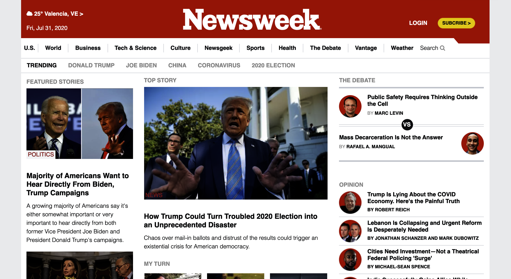

# Newsweek-Clone
Seventh training project on Microverse HMTL/CSS curriculum done with Bootstrap

## Built With

- HTML & CSS3,
- Bootstrap

## Live Demo

[Live Demo Link](https://raw.githack.com/pbkabali/Newsweek-Clone/Homepage-bootstrap/index.html)

## Getting Started

To get a local copy up and running follow these simple example steps.

### Prerequisites

- Code Editor
- Web Browser

### Setup

`$git clone https://github.com/pbkabali/Newsweek-Clone.git`

### Install

- Run a local server

### Usage

- Personal Project - Newsweek page

## Authors

👤 **Paul Balitema Kabali**

- Github: [@pbkabali](https://github.com/pbkabali)
- Twitter: [@pbkabali](https://twitter.com/pbkabali)
- Linkedin: [engineerbpk](https://linkedin.com/in/engineerbpk)

👤 **Miguel Uzcátegui**

- Github: [@Miguelus373](https://github.com/Miguelus373 )
- Linkedin: [Miguel-Uzcátegui](https://www.linkedin.com/in/miguelus/)

## 🤝 Contributing

Contributions, issues and feature requests are welcome!

Feel free to check the [issues page](https://github.com/pbkabali/Newsweek-Clone/issues).

## Show your support

Give a ⭐️ if you like this project!

## Acknowledgments

- Microverse Team 140 (The Cupids)
- Bootstrap 4
- W3 Schools

## 📝 License

This project is [MIT](lic.url) licensed.
